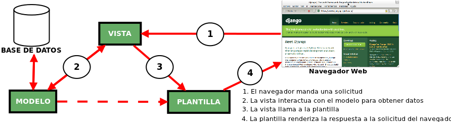
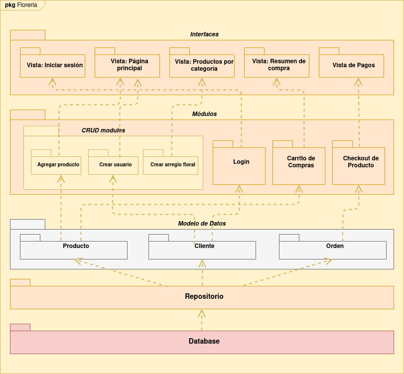
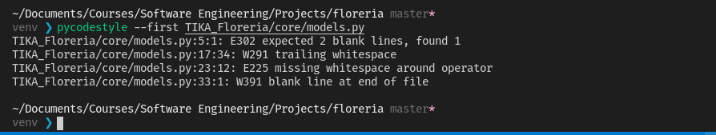

## Ejecucion del proyecto
### Usando y activando un entorno virtual
```shell
python -m venv venv
. venv/bin/activate
```
### Instalando requisitos de desarrollo
```shell
pip install -r requirements.txt
```
### Iniciando servidor
```shell
python manage.py runserver
```

<p align="center">
  
</p>

---

# Florería Dulces Detalles
Dulces Detalles es una plataforma web que nos va a permitir realizar compras de arreglos de flores basado en una tienda  virtual ,ademas de ofrecer un portal didáctico que permita registrar las personas que ingresen a la página  y realicen su pedido.

<p align="center">
  
</p>

### Proposito
Crear un sistema que ayude a incrementar el número de ventas y tener más cercanía con los clientes.
### Funcionalidades
El sistema debe:
- Tener por artículo:
  - Categoría a la que pertenece.
  - Descripción breve.
- Realizar operaciones sobre los orden:
  - Modificar, agregar, eliminar y consultar sobre un orden.
  - Búsqueda de ordenes por cliente.
  - Modificación del estado de un orden.

<p align="center">
  
</p>

### Arquitectura
Posee una organización de los 3 paquetes principales los cuales son vista, modelo y template utilizando el patrón arquitectónico MVT (Modelo Vista Template) en este patrón la vista actuaria como controlador, aunque con pequeños matices esto debido a que se utilizara el Framework Django.

<p align="center">
  
</p>

- **Vista**:la capa de la lógica de negocios.
   - Contiene clases para interactuar con el sistema para realizar una compra, pedido, registro, etc.
- **Template**:la capa de presentación.
   - Contiene clases para cada formularios que los actores usan para comunicarse con el sistema.
- **Modelo**:la capa de acceso a la base de datos.
   - Incluye clases de entidad para los usuarios y clases límite para la interfaz con el sistema de catálogo de productos.




## Prácticas de Codificación
Este proyecto sigue la guía de estilo [PEP 8](https://www.python.org/dev/peps/pep-0008/) para código en Python.

Podemos automatizar y chequear las convenciones de código usando herramientas como [pycodestyle](https://github.com/PyCQA/pycodestyle) y verificar si cumple con las recomendaciones para luego aplicar cambios de forma automática con [autopep8](https://github.com/hhatto/autopep8).

### Verificando convención de estilo según PEP8
Mostrando la primera ocurrencia de cada error
```shell
pycodestyle --first ./path/to/file
```


### Aplicando correcciones con autopep8
```shell
autopep8 --in-place ./path/to/file
```


### Usando flake8
Con flake8 podemos definir el estilo de programación que la compañía de software usará, teniendo como base las recomendaciones de PEP8. Se definieron las siguientas opciones de configuración:
```shell
max-line-length = 80
per-file-ignores =
    manage.py:F401
show_source = True
count = True
```

## Estilos de Programación
### Pipeline:
Consiste en ir transformando un flujo de datos en un proceso comprendido por varias fases secuenciales, siendo la entrada de cada una la salida de la anterior.
```python
class CatalogView(View):
    def get(self, request):
        products = ProductRepository().all()
        return render(request, '"products.html".html', {'products': products})
```
### Things:
Un objeto es una cápsula de datos que expone los procedimientos, donde no se accede a los datos directamente, solo a través de estos procedimientos. A continuacion presentamos al objeto Producto.
```python
class Product(object):
    def __init__(self, idProduct, title, description, price, category, image, slug):
        self.set_idProduct(idProduct)
        self.set_title(title)
        self.set_description(description)
        self.set_price(price)
        self.set_category(category)
        self.set_image(image)
        self.set_slug(slug)
    #...
```

### Abstract Things:
Se describe mediante las operaciones que los objetos de esa abstracción pueden hacer eventualmente. En nuestro caso se utiliza el siguiente objeto abstracto para ser utilizados luego en los repositorios de cada modulo.
```python
import abc

class AbstractDataMapper(object):
    __metaclass__ = abc.ABCMeta

    @abc.abstractmethod
    def find_all(self):
        return

    @abc.abstractmethod
    def find_by_id(self, id):
        return

    @abc.abstractmethod
    def create(self):
        return

    @abc.abstractmethod
    def update(self):
        return

    @abc.abstractmethod
    def delete(self):
        return
```

### Trinity
La aplicación se divide en tres componentes: el modelo, la vista y el controlador.
El modelo representa los datos de la aplicación; la vista representa una interpretación específica de los datos; el controlador proporciona entrada / salida.
(Debido a que se utiliza MVT)


## Principios SOLID
### Single Responsibility Principle (SRP):
Tiene como objetivo separar los comportamientos de modo que si surgen errores como resultado de su cambio, no afectarán otros comportamientos no relacionados.
Existe para el Modulo Client ya que cada clase posee una responsabilidad unica.
```python
class Client(object):
    def __init__(self, idClient, name, last_name):
        self.set_idClient(idClient)
        self.name = Name(name, last_name)
        self.shipping_address = None
    #...

class Name(object):  
    def __init__(self, first, last):
        self.set_first(first)
        self.set_last(last)
    #...

class Address(object):
    def __init__(self, street, number, city):
        self.set_street(street)
        self.set_number(number)
        self.set_city(city)
    #...
```

### Interface Segregation Principle (ISP)
Tiene como objetivo dividir un conjunto de acciones en conjuntos más pequeños para que una Clase ejecute solo el conjunto de acciones que requiere. Acontinuacion presentamos las accines divididas para Order

```python
class OrderCompleted(object):
    def __init__(self, order):
        self.order = order


class GenerateInvoice(OrderCompleted):
    def __init__(self):
        #...
    def run(self):
        #...


class RemoveProductFromInventory(OrderCompleted):
    def __init__(self):
        #...
    def run(self):
        #...
```

### Dependency Inversion Principle (DIP):
Los módulos de alto nivel no deben dependen de módulos de bajo nivel. Para ello se posee una abstraccion de los datos de los cuales se crearon repositorios para cada modulo.
```python
class AbstractDataMapper(object):
    __metaclass__ = abc.ABCMeta

    @abc.abstractmethod
    def find_all(self):
        return

    @abc.abstractmethod
    def find_by_id(self, id):
        return

    @abc.abstractmethod
    def create(self):
        return

    @abc.abstractmethod
    def update(self):
        return

    @abc.abstractmethod
    def delete(self):
        return

class ProductRepository(AbstractDataMapper):
    def find_all(self):
        #...
    def find_by_id(self, id):
        #...
    def create(self, product):
        #...
    def update(self, product):
    	  #...
    def delete(self, entity):
        #...
    def __load_entity(self, product_model):
        #...
```


## Conceptos Domain Driven Design (DDD)

### Modules:
Para un mejor desarrollo del proyecto el sistema de dividio en los siguientes modulos. Cada uno formados de clases relacionadas con las funcionalidad de la aplicación.
- Product
- Order
- Client


### Ubiquitous Language:

Se nombraron las variables, métodos y clases con lenguaje del dominio de modo que sea autoexplicable
- ```new_shipping_address(self, street, number, city)```: Asigna una nueva dirección de envío para un cliente.
- ```OrderSummaryView(LoginRequiredMixin, View)```: Vista para el resumen de las ordenes.
- Funciones para obtener ```get()``` y establecer ```set()``` para las entidades ```Client```, ```Name```, ```Address```, ```Order``` y ```Product```.


### Entities:
Existen las entidades Client, Order y Producto ya que son objeto del dominio que mantienen un estado y comportamiento más allá de la ejecución de la aplicación. A continuacion se muestra la entidad Cliente.

```python
class Client(object):

    def __init__(self, idClient, name, last_name):
        self.set_idClient(idClient)
        self.name = Name(name, last_name)
        self.shipping_address = None

    def set_idClient(self, idClient):
        self.idClient = idClient

    def get_idClient(self):
        return self.idClient

    def new_shipping_address(self, street, number, city):
        self.shipping_address = Address(street, number, city)
```

### Value Objects:
La Entidad ```Client``` posee un objeto de valor el cual es ```Name```, que se muestra a continuacion. Name es un objeto de valor ya que es conjunto de propiedades y comportamientos pero no mantiene identidad alguna.

```python
class Name(object):  
    def __init__(self, first, last):
        self.set_first(first)
        self.set_last(last)

    def set_first(self, first):
        self.first = first

    def get_first(self):
        return self.first

    def set_last(self, last):
        self.last = last

    def get_last(self):
        return self.last

    @property
    def full(self):
        return self.name + self.last_name
```

### Aggregates:
La Entidad ```Cliente``` posee un agregado ```Address``` ya que esta entidad posee relaciones con otras a nivel de negocio.
```python
class Address(object):

    def __init__(self, street, number, city):
        self.set_street(street)
        self.set_number(number)
        self.set_city(city)

    def set_street(self, street):
        self.street = street

    def set_number(self, street):
        self.number = number

    def set_city(self, city):
        self.city = city

    def get_street(self):
        return self.street

    def get_number(self):
        return self.number

    def get_city(self):
        return self.city
```

### Factories:
Debido a que la Entidad ```Order``` posee reglas de creación complejas, se creo ```OrderFactory``` para permiter abstraer, separar la lógica y reglas de creación de una entidad, dejando en las Entidad ```Order```  únicamente con las reglas de negocio que son inherentes a ella.

```python
class OrderFactory(object):

    @classmethod
    def create(cls, client_id, product_id):
        client = ClientRepository().get(client_id)
        product = ProductRepository().get(product_id)
        #...
        return Order(product, client)
```

### Repository
Se crearon los siguientes repositorios ```ClientRepository```, ```OrderRepository```, ```ProductRepository``` para que cada uno conozca el mecanismo se está utilizando para implementar la persistencia. A continuacion se muestra el repositorio para Cliente

```python

class ClientRepository(AbstractDataMapper):

    def find_all(self):
        client_models = ClientModel.objects.all()
        client_entities = []
        for client_model in client_models:
            client_entity = self.__load_entity(client_model)
            client_entities.append(client_entity)
        return client_entities

    def find_by_id(self, id):
        client_model = ClientModel.objects.get(idClient=id)
        client = self.__load_entity(client_model)
        return client

    def create(self, client):
        ClientModel(
            idClient=client.get_idClient(),
            first_name=client.get_first(),
            last_name=client.get_last()
        ).save()

    def update(self, client):
        client_model = ClientModel.objects.get(idClient=client.get_idClient())
        client_model.first_name = client.get_first()
        client_model.last_name = client.get_last()
        client_model.save()

    def delete(self, entity):
        pass

    def __load_entity(self, client_model):
        client_entity = Client(
            client_model.idClient,
            Name(client_model.name)
        )
        return client_entity
```

### Event:
Se crearon eventos ```OrderCompleted(object)```, ```GenerateInvoice(OrderCompleted)```,  ```RemoveProductFromInventory(OrderCompleted)``` para la Entidad  ```Order``` para organizar las operaciones de dominio en reacción a las acciones del cliente, product y eventos de dominio.

```python
class DomainEvents(object):

    def __init__(self):
        pass

    @classmethod
    def trigger(cls, event):

        handlers = set()
        for child in event.__class__.__subclasses__():
            if child not in handlers:
                handlers.add(child)

        for handler in handlers:
            handler_instance = handler()
            handler_instance.run()

class OrderCompletedView(View):
    #....
    client_id = request.POST['client_id']
    product_id = request.POST['product_id']

    order = OrderFactory.created(client_id,product_id)
    OrderRepository().save(order)
    DomainEvents.trigger(OrderCompleted(order))
```


## Integrantes
- Kemely Castillo Caccire
- Lesly Mita Yagua
- Jerson Zúñiga Coayla

---
<p align="center">
  
</p>
