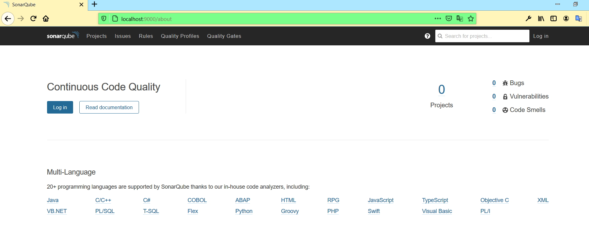
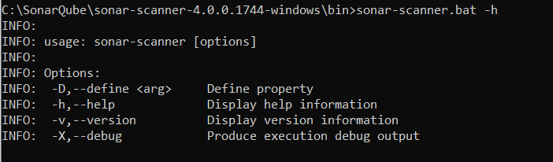
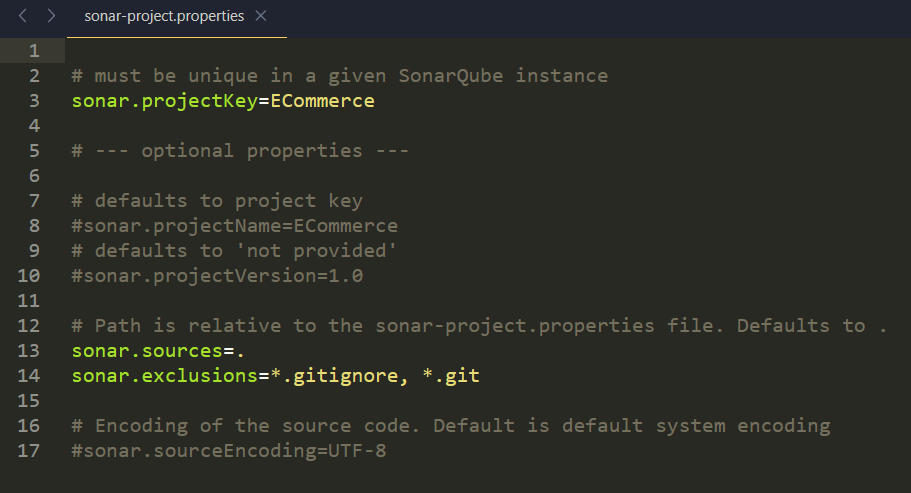
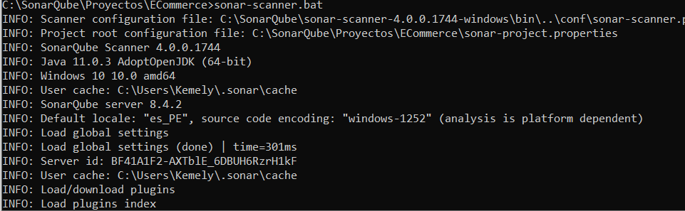
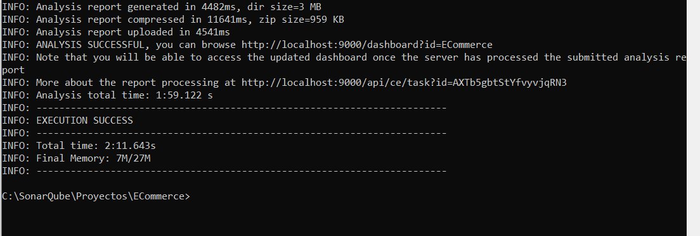
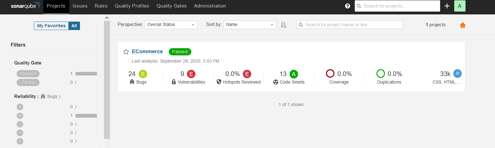

# IngSofware2
## Laboratorio 2
Utilizando este proyecto:
### a) Configurar y ejecutar SonarQube localmente
   En base al siguiente tutorial:https://docs.sonarqube.org/7.9/setup/get-started-2-minutes/
   + Download the SonarQube Community Edition
   + Unzip it, let's say in C:\sonarqube or /opt/sonarqube
   + Start the SonarQube Server:
   
   

         
   

   
   + Log in to http://localhost:9000 with System Administrator credentials (admin/admin) and follow the embedded tutorial to analyze your first project.
    

         
   

### b) Configurar SonarScanner
   En base al siguiente tutorial:https://docs.sonarqube.org/7.9/analysis/scan/sonarscanner/
   + Expand the downloaded file into the directory of your choice. We'll refer to it as $install_directory in the next steps.
   + Add the $install_directory/bin directory to your path.
   + Verify your installation by opening a new shell and executing the command sonar-scanner -h (sonar-scanner.bat -h on Windows). You should get output like this:
    

         
   
   

### c) Ejecutar SonarScanner
   En base al siguiente tutorial:https://docs.sonarqube.org/7.9/analysis/scan/sonarscanner/
   + Create a configuration file in the root directory of the project: sonar-project.properties
    
   
       

         
   
  
   + Run the following command from the project base directory to launch the analysis:sonar-scanner
       

         
   
   
       

         
   
   

### d) Visualizar resultados de SonarScanner en SonarQube:
   http://localhost:9000
    
   
       

         
   
  
    
   
       

         
   
  
