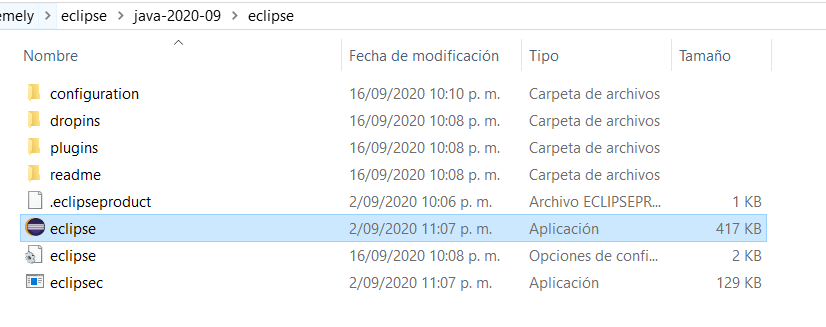
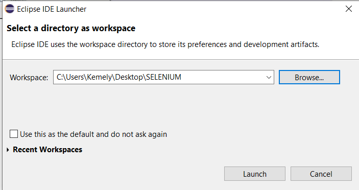
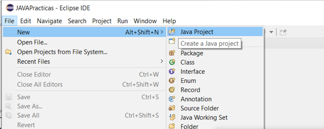
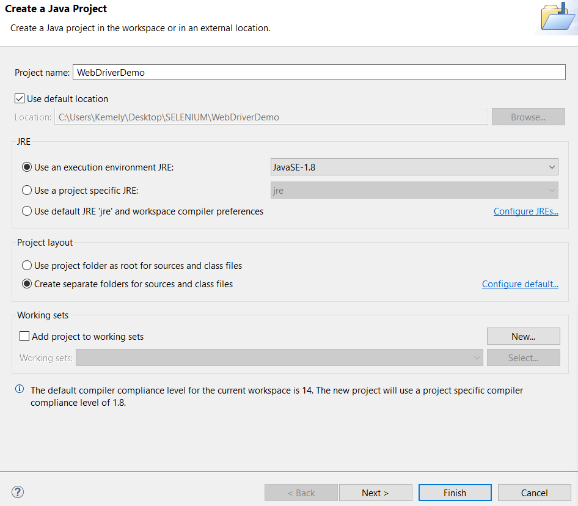
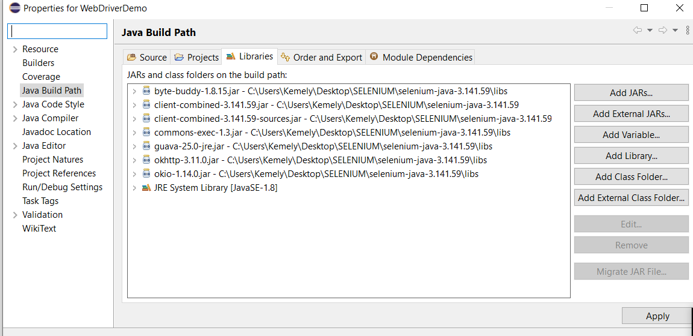
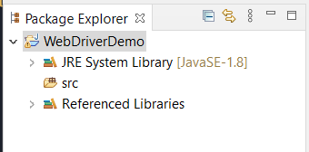
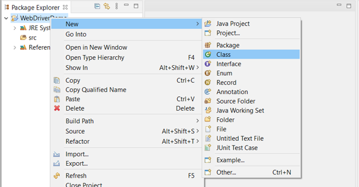
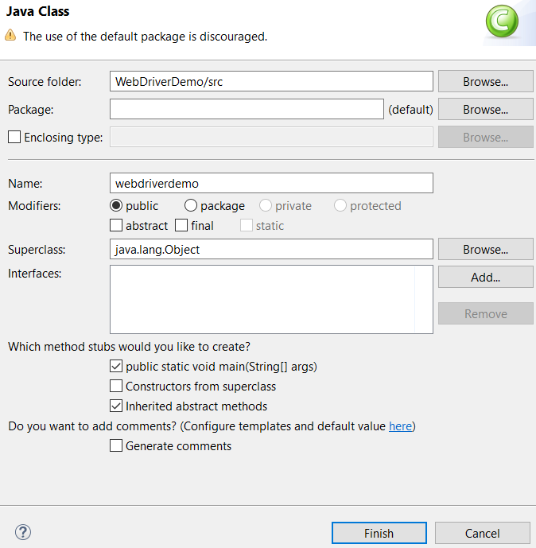
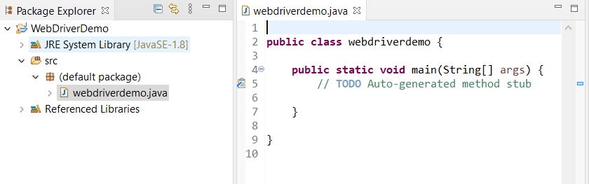
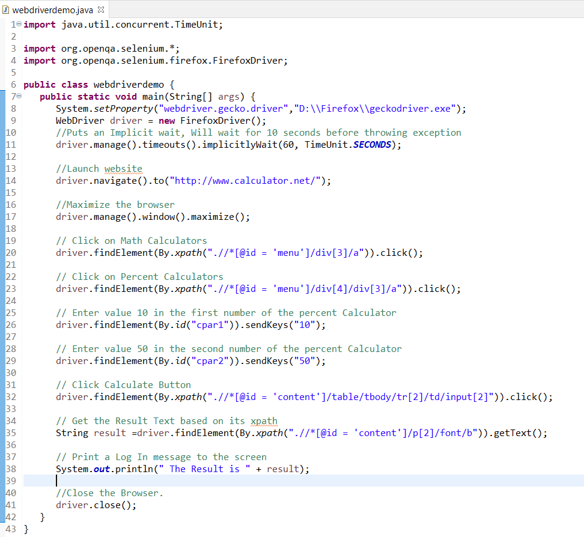

# Práctica 5: Pruebas Funcionales
## Objetivo
#### Automatizar pruebas funcionales de aplicaciones web utilizando Selenium Web Driver (https://www.selenium.dev/)
•	Pre-requisitos:
  1. [Java 8+] (También pueden implementarlos en Python, C# o JS)
  2. [Eclipse IDE]  u otro. 
  3. [Selenium Web Driver] (depende del lenguaje en el que se implementará).
  4. [Geckodriver]
  
## Actividades:
• Implementar Casos de prueba para la funcionalidad "Percentage Calculator" (https://www.calculator.net/percent-calculator.html). 
Basarse en https://www.tutorialspoint.com/selenium/selenium_webdriver.htm
  ### Scripting usando WebDriver
  ##### Paso 1 : Ejecute "Eclipse" desde la carpeta.
  

         
  

  
  ##### Paso 2 : Seleccione el espacio de trabajo haciendo clic en el botón 'Browse'.
  

         
  

  
  ##### Paso 3 : Ahora cree un 'New Project' desde el menú 'File' .
  

         
  

  
  ##### Paso 4 : Enter the Project Name and Click 'Next'.
  

         
  

  
  ##### Paso 5 : Go to Libraries Tab and select all the JAR's that we have downloaded.
  

         
  

  
  ##### Paso 6 : The Package is created as shown below.
  

         
  

  
  ##### Paso 7 : Ejecute "Eclipse" desde la carpeta.Now right-click on the package and select 'New' >> 'Class' to create a 'class'.
  

         
  

  
  ##### Paso 8 : Now name the class and make it the main function.
  

         
  

  
  ##### Paso 9 : The class outline is shown as below.
  

         
  

  
  ##### Paso 10 : Now it is time to code.
  

         
  

  1. Diseñar casos de prueba: Entradas, proceso, Resultado Esperado	:
  https://docs.google.com/spreadsheets/d/1K6bm9jiQkg6jQ6RagUPUrrNBT4QUL5bzqMI5gkM36B0/edit?usp=sharing
  
  2. Implementar los scripts de prueba
  3. Ejecutar los scripts de prueba
  4. Reportar los resultados de la ejecución
  
Documentación: https://selenium.dev/documentation/en/webdriver/

[//]: # (These are reference links used in the body of this note and get stripped out when the markdown processor does its job. There is no need to format nicely because it shouldn't be seen. Thanks SO - http://stackoverflow.com/questions/4823468/store-comments-in-markdown-syntax)
[Eclipse IDE]: http://www.reddit.com
[Selenium Web Driver]:https://www.selenium.dev/downloads/
[Geckodriver]:https://github.com/mozilla/geckodriver/releases
[Java 8+]:https://www.java.com/es/download/
